# Solucion del proyecto

- **Proyecto:** GESTOR HOTEL - Sistema de Gestion de Reservas
- **Alumno/a:** Jordi Antonio Vázquez López
- **Repositorio:** <!-- URL del repositorio -->

## 1. Resumen del proyecto

- **Problema que resuelve:** Gestionar las reservas de un hotel, registrar clientes, controlar las habitaciones, reportar incidencias que pasan durante la estancia y guardar comentarios.
- **Usuarios principales:** Recepcionistas y personal del hotel que tienen que llevar el control de las reservas y las incidencias.
- **Funcionalidades principales:**
  - CRUD de clientes con validacion de NIF, email y telefono
  - CRUD de reservas con control de estados (pendiente, confirmada, cancelada, finalizada)
  - CRUD de incidencias guardadas en MongoDB Atlas
  - Check-out con opcion de reportar incidencia y pagar
  - Importacion de datos desde JSON y exportacion a TXT
  - Comentarios de clientes en MongoDB
- **Entidades principales:**
  - `Cliente` - datos personales del cliente (NIF, nombre, email, telefono)
  - `Habitacion` - informacion de las habitaciones
  - `Reserva` - vincula cliente + habitacion con fechas y estado
  - `Incidencia` - problemas reportados (habitacion, descripcion, fecha)
  - `ComentarioCliente` - opiniones de los clientes guardadas en MongoDB
- **Estructura del proyecto:**
  - `app/menu` - menu principal y submenus
  - `model/` - clases de dominio
  - `service/`- logica de negocio
  - `repository/` - acceso a datos
  - `validator/`- validaciones con regex
  - `exception/`- excepciones 
  - `util/` - conexiones a BD

## 2. Instalacion y ejecucion

```bash
./gradlew run
```

- **Requisitos previos:** JDK 21, Gradle wrapper, conexion a internet. MongoDB Atlas necesita credenciales en `ConexionMongo.kt`.
- **Configuracion necesaria:** H2 funciona solo, no necesita instalacion. Para MongoDB hay que tener la URI correcta en `util/ConexionMongo.kt`.
- **Datos de prueba incluidos:** `datos_prueba.json` en la raiz con 10 clientes y 11 reservas. Se importa desde el menu (opcion 5 -> 1).

## 3. Diseno y modelo

- **Clases principales:**
  - `Cliente` - datos del huesped
  - `Habitacion` - catalogo de habitaciones
  - `Reserva` - reserva con estados y control de pago
  - `Incidencia`- incidencia con fecha y resuelta
  - `ComentarioCliente` - comentarios en MongoDB
- **Relaciones importantes:**
  - `Repositorio<T, ID>`  es una interfaz generica que define el CRUD
  - `ClienteDao`, `ReservaDao`, `IncidenciaRepository`, etc. implementan `Repositorio`
  - Los servicios usan `Repositorio` por constructor (DIP)
- **Genericos usados:** `Repositorio<T, ID>` permite reutilizar el mismo contrato para clientes (String ID), reservas (Int ID), incidencias (String ID), etc.
- **Colecciones usadas:** `List<T>` para devolver resultados de base de datos. `MutableList` dentro de los DAO para ir agregando filas del `ResultSet`.
- **Principios SOLID aplicados:**
  - **SRP:** `ClienteDao` solo accede a clientes, `Validador` solo valida, `ReservaService` solo tiene logica de reservas. Cada clase hace una cosa y solo una.
  - **OCP:** La interfaz `Repositorio<T, ID>` permite anadir nuevas entidades (como `ComentarioClienteRepository`) sin modificar el codigo existente de la interfaz.
  - **LSP:** Cualquier implementacion de `Repositorio<T, ID>` (H2 con `ClienteDao`, MongoDB con `IncidenciaRepository`) se puede intercambiar sin que los servicios se enteren.
  - **ISP:** Las funciones del menu (`nuevaReserva`, `menuIncidencias`, `checkout`) solo dependen de los servicios que realmente necesitan, no de todos. `nuevaReserva` no recibe `IncidenciaService`, `menuIncidencias` no recibe `ReservaService`.
  - **DIP:** Los servicios reciben `Repositorio<T, ID>` por constructor, no una clase concreta. Ver `service/ClienteService.kt:10`.
- **Patrones de diseno:**
  - **DAO:** `ClienteDao`, `ReservaDao`, `HabitacionDao` para separar el SQL de la logica
  - **Repository:** `IncidenciaRepository` y `ComentarioClienteRepository` para MongoDB
  - **Singleton:** `ConexionH2` y `ConexionMongo` son object que mantienen una unica conexion

## 4. Persistencia

### Ficheros

- **Ficheros usados:**
  - `datos_prueba.json` - importacion de clientes y reservas
  - `reservas.txt` - informe de reservas generado desde el menu
  - `incidencias.txt` - informe de incidencias generado desde el menu
- **Formato y contenido:** JSON para importacion de datos estructurados, TXT para informes legibles.
- **Lectura/escritura:** Solo lectura de JSON (importacion) y escritura de TXT (informes).
- **Clase responsable:** `FicheroRepository`.
- **Errores controlados:** Si el fichero no existe se lanza `FicheroException` (try-catch en el menu `app/Menu.kt`).

### MongoDB

- **Base de datos:** `hotel_maligno` en MongoDB Atlas
- **Colecciones:**
  - `incidencias` - incidencias reportadas durante las estancias
  - `comentarios_clientes` - comentarios y opiniones de los clientes
- **Documento de ejemplo (incidencia):**

- **Operaciones realizadas:** Insertar, buscar por id, listar todas, filtrar por habitacion, listar pendientes, marcar como resuelta, eliminar.
- **Clase responsable:** `IncidenciaRepository` y `ComentarioClienteRepository`.
### Base de datos relacional

- **SGBD utilizado:** H2 en modo embebido, fichero `data/gestorhotel.mv.db`.
- **Script SQL:** `sql/Script.sql` con las sentencias CREATE TABLE de clientes, habitaciones y reservas.
- **Tablas y relaciones:**
  - `clientes` (id VARCHAR PRIMARY KEY, nombre, email, telefono)
  - `habitaciones` (numero INT PRIMARY KEY, tipo, precio_noche, disponible)
  - `reservas` (id INT AUTO_INCREMENT, id_cliente FK->clientes, numero_habitacion FK->habitaciones, fecha_entrada, fecha_salida, estado, pagada, num_personas, segundo_huesped)
- **Operaciones CRUD:** Clientes (`ClienteDao`), habitaciones (`HabitacionDao`), reservas (`ReservaDao`) con CRUD completo.
- **Consultas parametrizadas:** Todas las consultas usan `PreparedStatement`. Ejemplo en `repository/ClienteDao.kt:22`.
- **Gestion de conexion:** `ConexionH2` con inicializacion perezosa y `DriverManager.getConnection()` en `util/ConexionH2.kt`.

## 5. Validaciones y errores

- **Expresiones regulares** en `validator/Validador.kt`:
  - **Email:** `^[\w.-]+@[\w.-]+\.\w{2,}$` - Valido: `juan@email.com`, No valido: `juan@.com`
  - **Telefono:** `^\+?\d{9,15}$` - Valido: `612345678`, No valido: `123`
  - **NIF:** `^\d{8}[A-Z]$` + modulo 23 - Valido: `12345678Z`, No valido: `12345678A`
- **Excepciones controladas:** Errores de conexion, busquedas sin resultado, CRUD fallido, fecha mal formateada, NIF/email/telefono invalidos.
- **Excepciones propias** en `exception/Excepciones.kt`:
  - `EntidadNoEncontradaException` - cuando no se encuentra un registro
  - `ValidacionException` - cuando un dato no pasa la validacion
  - `ConexionBaseDatosException` - error de conexion a BD
  - `FicheroException` - error de lectura/escritura de ficheros
  - `MongoDBException` - error al operar con MongoDB

## 6. Pruebas y evidencias

- **Pruebas realizadas:** Manuales probando cada opcion del menu con los datos de `datos_prueba.json`.
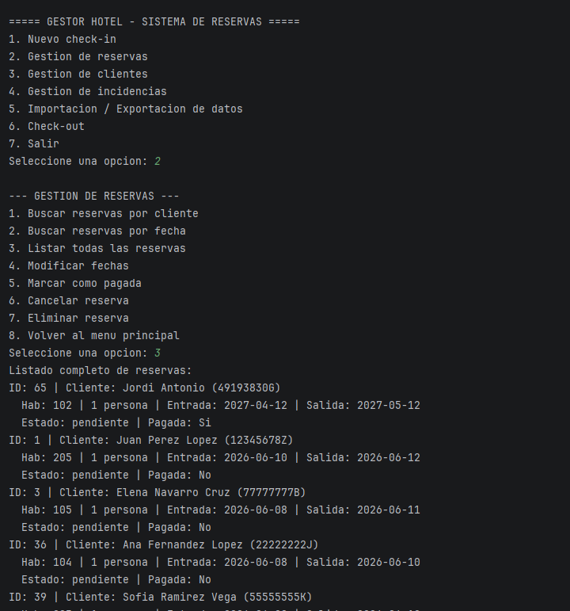
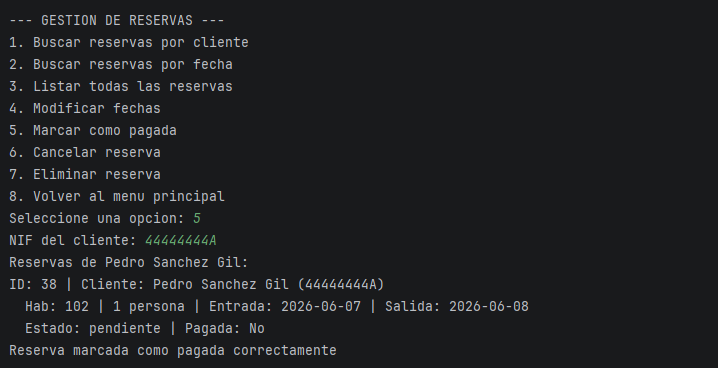
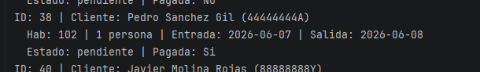
- **Datos de prueba:** `datos_prueba.json` con 10 clientes de DNI valido y 11 reservas.
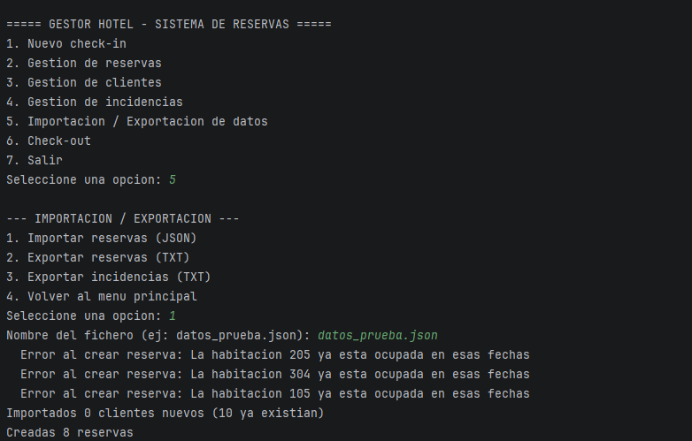
- **Evidencia de ejecucion:** La consola muestra los menus y las operaciones realizadas.
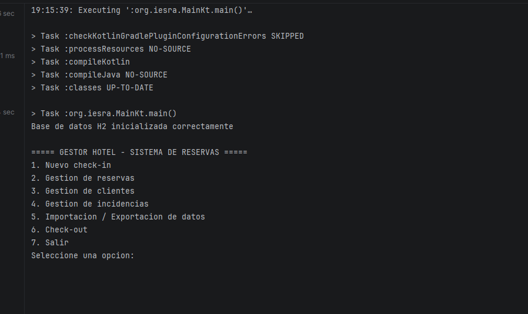
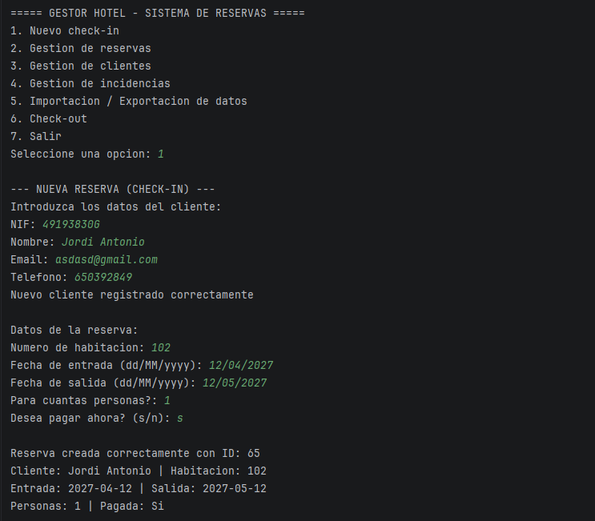
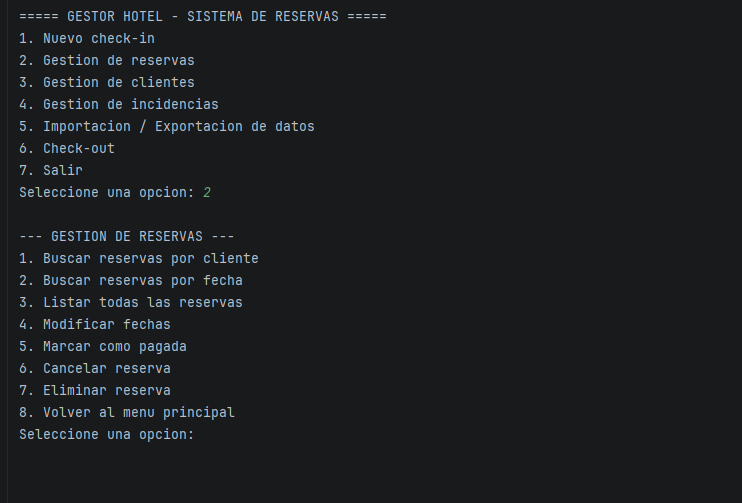
- **Evidencia de ficheros:** `reservas.txt` e `incidencias.txt` se generan desde la opcion 5 del menu.
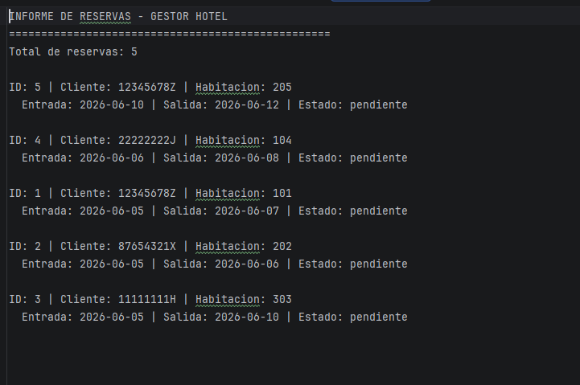
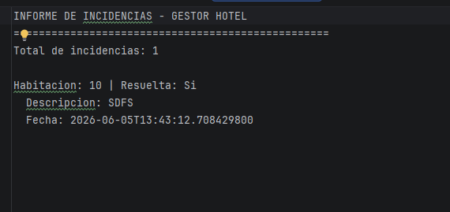
- **Evidencia de MongoDB:** Las incidencias y comentarios se guardan en MongoDB Atlas.
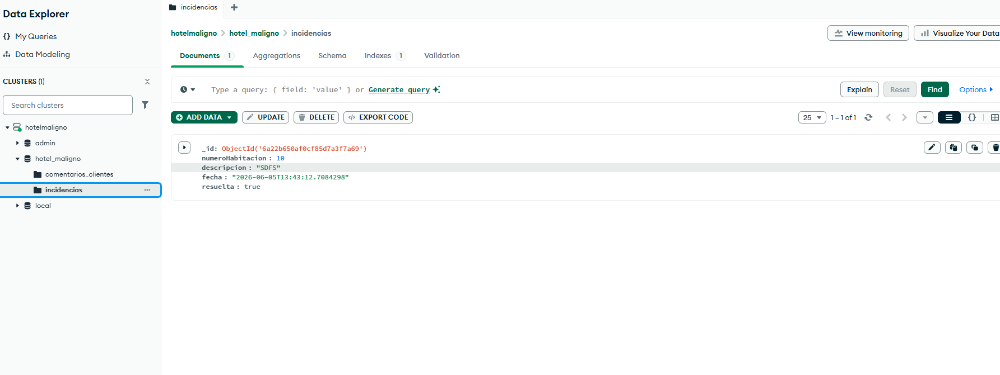
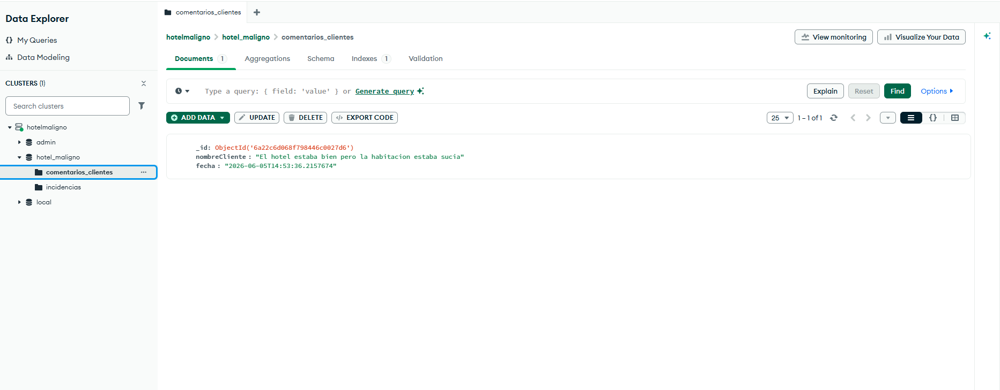
- **Evidencia de SQL:** Los datos de clientes, habitaciones y reservas se almacenan en H2.
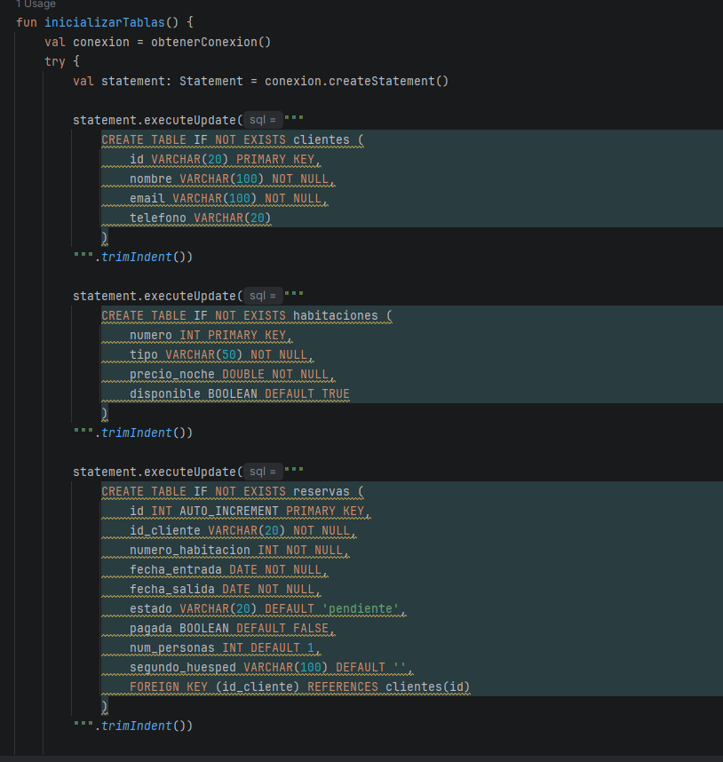
- 
## 7. Refactorizacion, documentacion y Git

- **Refactorizaciones aplicadas:** Los menus se separaron en funciones independientes (`nuevaReserva`, `menuReservas`, `menuClientes`, `menuIncidencias`, `menuImportarExportar`, `checkout`) para que el main sea mas legible.
- **Codigo limpio:** Nombres descriptivos, funciones cortas, estructura de paquetes clara, sin codigo duplicado.
- **Documentacion:** Este archivo `SOLUCION_2526_PRO_u9_proyecto.md`.
- **Control de versiones:** Git con commits.

## 8. Problemas encontrados y soluciones

| Problema | Solucion aplicada | Enlace o evidencia |
|----------|-------------------|--------------------|
| MongoDB no se conectaba por la URI | Revisar la cadena de conexion en ConexionMongo | `util/ConexionMongo.kt` |
| Las reservas no se podian crear con fecha pasada | Validacion en ReservaService (fecha>=hoy) | `service/ReservaService.kt` |

## 9. Respuestas a los criterios de evaluacion

### 9.1. Diseno general

El proyecto GESTOR HOTEL es un sistema de gestion de reservas para un hotel. Resuelve el problema de organizar clientes, habitaciones, reservas e incidencias de forma centralizada usando una aplicacion de consola. Va dirigido a recepcionistas que necesitan gestionar las estancias.

**Entidades principales:** Cliente, Habitacion, Reserva, Incidencia, ComentarioCliente.
**Funcionalidades:** CRUD de clientes, reservas e incidencias, check-in y check-out, importacion JSON, exportacion TXT.
**Estructura:** Separacion en capas: `app/` (interfaz), `service/` (logica), `repository/` (datos), `model/` (entidades), `validator/` (validaciones), `exception/` (errores), `util/` (conexiones). Las clases estan en `app/Menu.kt`, `model/Cliente.kt`, `service/ClienteService.kt`, etc.

### 9.2. Clases y objetos

Las clases principales son `Cliente`, `Habitacion`, `Reserva`, `Incidencia` y `ComentarioCliente` en `model/`. Todas son `data class` porque su funcion es almacenar datos. Los servicios (`ClienteService`, `ReservaService`) tienen la logica de negocio. Los DAO y repositorios gestionan la persistencia. En `app/Menu.kt` se instancian los servicios y el repositorio de ficheros.
https://github.com/IES-Rafael-Alberti/2526-u8u9-9-1-proyectolibre-jvazlop/blob/61fb1f8c86ae64af3cd5d5e927eb6a61319b7440/src/main/kotlin/model/Cliente.kt#L3-L8
https://github.com/IES-Rafael-Alberti/2526-u8u9-9-1-proyectolibre-jvazlop/blob/61fb1f8c86ae64af3cd5d5e927eb6a61319b7440/src/main/kotlin/model/ComentarioCliente.kt#L5-L9
https://github.com/IES-Rafael-Alberti/2526-u8u9-9-1-proyectolibre-jvazlop/blob/61fb1f8c86ae64af3cd5d5e927eb6a61319b7440/src/main/kotlin/model/Habitacion.kt#L3-L7
https://github.com/IES-Rafael-Alberti/2526-u8u9-9-1-proyectolibre-jvazlop/blob/61fb1f8c86ae64af3cd5d5e927eb6a61319b7440/src/main/kotlin/model/Incidencia.kt#L5-L11
https://github.com/IES-Rafael-Alberti/2526-u8u9-9-1-proyectolibre-jvazlop/blob/61fb1f8c86ae64af3cd5d5e927eb6a61319b7440/src/main/kotlin/model/Reserva.kt#L5-L14

### 9.3. Encapsulacion y visibilidad

Las propiedades de las data classes son `val` (inmutables) o `var` (modificables como `estado` y `pagada` en Reserva). Las constantes como `ESTADO_PENDIENTE`, `ESTADO_CONFIRMADA`, etc. son `const val` dentro del companion object de `Reserva` (`model/Reserva.kt`). Los servicios encapsulan la logica y llaman a los validadores antes de modificar datos.
https://github.com/IES-Rafael-Alberti/2526-u8u9-9-1-proyectolibre-jvazlop/blob/61fb1f8c86ae64af3cd5d5e927eb6a61319b7440/src/main/kotlin/model/Reserva.kt#L5-L22

### 9.4. Colecciones

Se usa `List<T>` para devolver resultados (ej: `reservaService.listarReservas()` devuelve `List<Reserva>`). En los DAO se usa `MutableList` internamente para ir agregando filas del `ResultSet` (ej: `repository/ClienteDao.kt`). La eleccion es `List` por ser la interfaz mas simple y adecuada para datos de solo lectura.

https://github.com/IES-Rafael-Alberti/2526-u8u9-9-1-proyectolibre-jvazlop/blob/61fb1f8c86ae64af3cd5d5e927eb6a61319b7440/src/main/kotlin/repository/ClienteDao.kt#L43-L48

### 9.5. Genericos

La interfaz `Repositorio<T, ID>` es generica con dos parametros: el tipo de entidad `T` y el tipo de identificador `ID`. Define metodos como `guardar(T): T`, `buscarPorId(ID): T?`, `buscarTodos(): List<T>`, `actualizar(T): T`, `eliminar(ID): Boolean`. Esto permite que `ClienteDao` use `Repositorio<Cliente, String>`, `ReservaDao` use `Repositorio<Reserva, Int>`, etc. sin repetir codigo.
https://github.com/IES-Rafael-Alberti/2526-u8u9-9-1-proyectolibre-jvazlop/blob/61fb1f8c86ae64af3cd5d5e927eb6a61319b7440/src/main/kotlin/repository/Repositorio.kt#L3-L9

### 9.6. Herencia, interfaces o clases abstractas

`Repositorio<T, ID>` es una interfaz. `ClienteDao`, `ReservaDao`, `HabitacionDao` e `IncidenciaRepository`  la implementan. Esto permite polimorfismo: los servicios pueden trabajar con cualquier implementacion (DIP).

https://github.com/IES-Rafael-Alberti/2526-u8u9-9-1-proyectolibre-jvazlop/blob/61fb1f8c86ae64af3cd5d5e927eb6a61319b7440/src/main/kotlin/repository/Repositorio.kt#L3-L9
https://github.com/IES-Rafael-Alberti/2526-u8u9-9-1-proyectolibre-jvazlop/blob/61fb1f8c86ae64af3cd5d5e927eb6a61319b7440/src/main/kotlin/repository/ClienteDao.kt#L9
https://github.com/IES-Rafael-Alberti/2526-u8u9-9-1-proyectolibre-jvazlop/blob/61fb1f8c86ae64af3cd5d5e927eb6a61319b7440/src/main/kotlin/repository/HabitacionDao.kt#L9
https://github.com/IES-Rafael-Alberti/2526-u8u9-9-1-proyectolibre-jvazlop/blob/61fb1f8c86ae64af3cd5d5e927eb6a61319b7440/src/main/kotlin/repository/ReservaDao.kt#L11
https://github.com/IES-Rafael-Alberti/2526-u8u9-9-1-proyectolibre-jvazlop/blob/61fb1f8c86ae64af3cd5d5e927eb6a61319b7440/src/main/kotlin/repository/IncidenciaRepository.kt#L12
### 9.7. Expresiones regulares

En `validator/Validador.kt`:
- **Email:** `^[\w.-]+@[\w.-]+\.\w{2,}$` - Valido: `juan@email.com`, No valido: `juan@.com`
- **Telefono:** `^\+?\d{9,15}$` - Valido: `+34612345678`, No valido: `abc123`
- **NIF:** `^\d{8}[A-Z]$` mas modulo 23 con `LETRAS_NIF = "TRWAGMYFPDXBNJZSQVHLCKE"` - Valido: `12345678Z`, No valido: `12345678A` (letra incorrecta)

https://github.com/IES-Rafael-Alberti/2526-u8u9-9-1-proyectolibre-jvazlop/blob/61fb1f8c86ae64af3cd5d5e927eb6a61319b7440/src/main/kotlin/validator/Validador.kt#L5-L11

### 9.8. Ficheros

`FicheroRepository`. Metodos:
- `importarDatosPrueba(ruta)` - lee JSON con clientes y reservas usando Gson
  https://github.com/IES-Rafael-Alberti/2526-u8u9-9-1-proyectolibre-jvazlop/blob/61fb1f8c86ae64af3cd5d5e927eb6a61319b7440/src/main/kotlin/repository/FicheroRepository.kt#L64-L72
- `generarInformeReservas(reservas, ruta)` - genera TXT con listado de reservas
  https://github.com/IES-Rafael-Alberti/2526-u8u9-9-1-proyectolibre-jvazlop/blob/61fb1f8c86ae64af3cd5d5e927eb6a61319b7440/src/main/kotlin/repository/FicheroRepository.kt#L47-L62
- `exportarIncidenciasATxt(incidencias, ruta)` - genera TXT con incidencias
  https://github.com/IES-Rafael-Alberti/2526-u8u9-9-1-proyectolibre-jvazlop/blob/61fb1f8c86ae64af3cd5d5e927eb6a61319b7440/src/main/kotlin/repository/FicheroRepository.kt#L73-L88
  
Si falla se lanza `FicheroException`. Los errores se capturan en `app/Menu.kt`.

### 9.9. MongoDB

Base de datos `hotel_maligno` en MongoDB Atlas. Colecciones:
- `incidencias` - gestionada por `IncidenciaRepository` (`repository/IncidenciaRepository.kt`)
- `comentarios_clientes` - gestionada por `ComentarioClienteRepository` (`repository/ComentarioClienteRepository.kt`)
Operaciones: insertar, buscar por id/ObjectId, listar, filtrar, actualizar (resuelta), eliminar. Las consultas usan `Filters.eq()`, `Filters.and()` de la API de MongoDB.

### 9.10. Base de datos relacional

SGBD: H2 embebido en `data/gestorhotel.mv.db`. Tablas: `clientes`, `habitaciones`, `reservas` con FK de `reservas.id_cliente` -> `clientes.id` y `reservas.numero_habitacion` -> `habitaciones.numero`. Las tablas se crean en `util/ConexionH2.kt:23` con CREATE TABLE IF NOT EXISTS. CRUD en `ClienteDao`, `ReservaDao`, `HabitacionDao`. Consultas parametrizadas con `PreparedStatement` (ej: `repository/ClienteDao.kt`). Conexion con `DriverManager` en `util/ConexionH2.kt`.

### 9.11. Excepciones

Excepciones propias en `exception/Excepciones.kt:`:
- `EntidadNoEncontradaException` - cuando un buscador no encuentra el registro
- `ValidacionException` - cuando un dato no pasa la validacion (NIF, email, telefono)
- `ConexionBaseDatosException` - error al conectar con H2
- `FicheroException` - error al leer/escribir ficheros
- `MongoDBException` - error al operar con MongoDB

Se capturan en los menus con try-catch mostrando mensajes al usuario. Ej: `app/Menu.kt` captura `EntidadNoEncontradaException` en checkout.

### 9.12. SOLID y buenas practicas

- **SRP:** Cada clase tiene una unica responsabilidad. `ClienteDao` solo accede a la tabla de clientes, `Validador` solo valida datos, `ClienteService` solo contiene logica de negocio de clientes, `ConexionH2` solo gestiona la conexion a H2. Ninguna clase mezcla responsabilidades.
- **OCP:** La interfaz `Repositorio<T, ID>` permite extender el sistema anadiendo nuevos DAOs o repositorios sin modificar el codigo existente. Por ejemplo, se anadio `ComentarioClienteRepository` implementando la misma interfaz sin tocar `Repositorio`.
- **LSP:** Todas las implementaciones de `Repositorio<T, ID>` (`ClienteDao`, `ReservaDao`, `IncidenciaRepository`) son intercambiables. Los servicios funcionan con cualquiera porque dependen de la abstraccion, no de la implementacion concreta.
- **ISP:** Las funciones del menu estan separadas para que cada una solo reciba los servicios que necesita. `nuevaReserva(clienteService, reservaService)` no recibe `IncidenciaService`. `menuIncidencias(incidenciaService)` no recibe servicios de clientes. Ninguna funcion depende de metodos que no usa.
- **DIP:** Los servicios reciben `Repositorio<T, ID>` en su constructor como parametro, no instancian directamente clases concretas. Esto permite cambiar la implementacion (H2, MongoDB, ficheros) sin modificar el servicio.

### 9.13. Librerias externas

En `build.gradle.kts`:
- **org.mongodb:mongodb-driver-sync:4.11.1** - Cliente oficial de MongoDB para conexion con Atlas
- **com.h2database:h2:2.2.224** - Base de datos relacional embebida
- **com.google.code.gson:gson:2.10.1** - Serializacion JSON para ficheros
- **org.slf4j:slf4j-simple:2.0.9** - Logs de las librerias (MongoDB, H2)
- **io.kotest:kotest-runner-junit5:5.8.0** - Framework de testing

### 9.14. Pruebas y evidencias

Pruebas manuales ejecutando la aplicacion y probando cada opcion del menu. Los datos de prueba se importan desde `datos_prueba.json` (opcion 5 -> 1). Se puede verificar:
- CRUD de clientes (opcion 3), reservas (opcion 2), incidencias (opcion 4)
- Check-in (opcion 1) y check-out (opcion 6)
- Importacion y exportacion (opcion 5)
- Los ficheros TXT se generan en la raiz del proyecto

### 9.15. Refactorizacion y codigo limpio

Los menus se extrajeron a funciones separadas: `nuevaReserva`, `menuReservas`, `menuClientes`, `menuIncidencias`, `menuImportarExportar`, `checkout` en `app/Menu.kt`. Esto evita un main de 500+ lineas. Nombres de variables descriptivos, estructura de paquetes clara, sin codigo repetido.

### 9.16. Patrones de diseno

- **DAO:** `ClienteDao`, `ReservaDao`, `HabitacionDao` encapsulan el acceso a H2 con SQL
- **Repository:** `IncidenciaRepository` y `ComentarioClienteRepository` encapsulan el acceso a MongoDB
- **Singleton:** `ConexionH2` y `ConexionMongo` como `object` de Kotlin
- **Dependency Injection:** Los servicios reciben sus dependencias por constructor (ej: `service/ClienteService.kt`)

### 9.17. Documentacion

Este archivo `SOLUCION_2526_PRO_u9_proyecto.md` contiene toda la documentacion. Los ficheros exportados se guardan en la raiz del proyecto. El README.md contiene el enunciado del proyecto.

### 9.18. Control de versiones

Git con commits incrementales: cada commit anade una funcionalidad completa (modelo, DAOs, servicios, menus). El repositorio contiene todo el codigo fuente, el JSON de datos de prueba y este documento.

## 10. Conclusiones

- **Que he aprendido:** A integrar tres tipos de persistencia (H2, MongoDB, ficheros) en una misma app Kotlin, usar genericos con `Repositorio<T, ID>`, aplicar SRP y DIP, y hacer validaciones con expresiones regulares.
- **Que mejoraria si tuviera mas tiempo:** Pruebas automatizadas con Kotest, validar disponibilidad de habitaciones por fechas, interfaz grafica, y mas control de errores en la entrada de datos y base de datos real de habitaciones.
- **Decision tecnica mas importante:** Usar H2 embebido como BD relacional para que no haga falta instalar nada externo, y MongoDB Atlas para las incidencias porque es una coleccion que crece mucho y no necesita relaciones.

## 11. Autoevaluacion

### 11.1. Programacion

| Criterio | Puntuacion/Nivel | Justificacion de la puntuacion |
|----------|------------------|--------------------------------|
| Completitud de requisitos minimos | 7.5 | POO con data classes, colecciones (List), genericos (Repositorio<T, ID>), interfaces (Repositorio), regex (Validador), 5 excepciones propias, SOLID (SRP, DIP), 5 librerias externas. |
| Acceso a ficheros | 5 | Importacion JSON con Gson y exportacion TXT. No hay exportacion a JSON de datos actuales. |
| Integracion de MongoDB | 7.5 | Dos colecciones (incidencias y comentarios) con CRUD completo en MongoDB Atlas. |
| Base de datos relacional y operaciones CRUD | 7.5 | H2 con 3 tablas relacionadas, FK, CRUD mediante DAO, PreparedStatement. |
| Preguntas de evaluacion de Programacion | 7.5 | Respondidas con enlaces al codigo y justificacion tecnica. |

### 11.2. Entornos de Desarrollo

| Criterio | Puntuacion/Nivel | Justificacion de la puntuacion |
|----------|------------------|--------------------------------|
| Refactorizacion y codigo limpio | <!-- 0 / 2.5 / 5 / 7.5 / 10 --> | <!-- Refactorizaciones, tecnicas aplicadas, mejoras y ejemplos. --> |
| Patrones de diseno | <!-- 0 / 2.5 / 5 / 7.5 / 10 --> | <!-- Patron usado, ubicacion, problema resuelto y ventaja. --> |
| Documentacion | <!-- 0 / 2.5 / 5 / 7.5 / 10 --> | <!-- Herramientas, partes documentadas, formato y ejemplo. --> |
| Control de versiones | <!-- 0 / 2.5 / 5 / 7.5 / 10 --> | <!-- Commits, ramas, repositorio, conflictos si existen e historial. --> |
| Preguntas de evaluacion de Entornos de Desarrollo | <!-- 0 / 2.5 / 5 / 7.5 / 10 --> | <!-- Justifica si las respuestas de Entornos estan completas, son tecnicas e incluyen enlaces y evidencias. --> |
